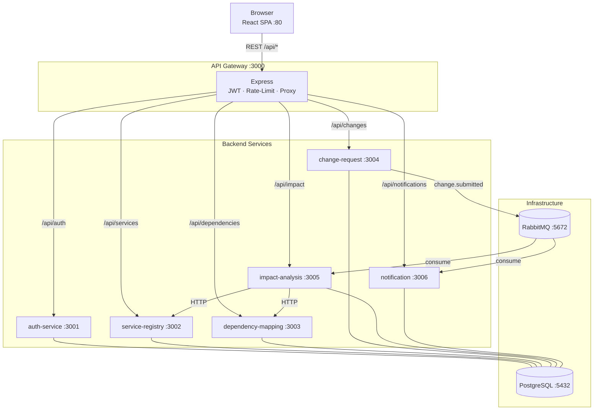

# System Architecture — MCIA (Microservice Change Impact Analyzer)

## 1. Overview

MCIA is a **polyrepo-style monorepo** (managed with npm workspaces) that orchestrates six backend microservices, an API gateway, and a React frontend. The platform allows engineering teams to register microservices, map their inter-dependencies, raise change requests, and automatically analyse the blast-radius of any proposed change.

---

## 2. High-Level Architecture

```
┌─────────────────────────────────────────────────────────────────────────┐
│                          CLIENT (Browser)                               │
│                     React + Vite SPA  :80                               │
└────────────────────────────┬────────────────────────────────────────────┘
                             │ HTTPS / REST
                             ▼
┌─────────────────────────────────────────────────────────────────────────┐
│                        API GATEWAY  :3000                               │
│   Helmet · CORS · Rate-Limit (100 req/15 min) · Morgan logging         │
│   JWT verification middleware on all protected routes                   │
│   http-proxy-middleware → downstream services                           │
└──┬───────────┬──────────────┬──────────────┬────────────┬──────────────┘
   │           │              │              │            │
   ▼           ▼              ▼              ▼            ▼
:3001       :3002           :3003          :3004        :3005 :3006
Auth      Registry       Dependency     Change        Impact  Notif.
Service   Service        Mapping        Request       Anal.   Service
          Service        Service        Service       Service
   │           │              │              │            │       │
   ▼           ▼              ▼              ▼            ▼       ▼
auth_db   registry_db   dependency_db   change_db  impact_db notif_db
                    (all backed by a single PostgreSQL :5432 instance)
                              │              │            │       │
                              └──────────────┴────────────┴───────┘
                                          RabbitMQ :5672
                                    (async event backbone)
```

---

## 3. Service Catalogue

| Service | Port | DB | Depends On | Role |
|---|---|---|---|---|
| **api-gateway** | 3000 | — | all services (health) | Single entry-point; JWT auth + reverse proxy |
| **auth-service** | 3001 | `auth_db` | PostgreSQL | Register / login / JWT issuance |
| **service-registry-service** | 3002 | `registry_db` | PostgreSQL | CRUD for microservices & endpoints |
| **dependency-mapping-service** | 3003 | `dependency_db` | PostgreSQL | CRUD for directed dependency edges |
| **change-request-service** | 3004 | `change_db` | PostgreSQL, RabbitMQ | Change request lifecycle; emits events |
| **impact-analysis-service** | 3005 | `impact_db` | PostgreSQL, RabbitMQ, :3003, :3002 | Consumes events; runs blast-radius algorithm |
| **notification-service** | 3006 | `notification_db` | PostgreSQL, RabbitMQ | Consumes events; stores in-app notifications |
| **frontend** | 80 | — | api-gateway | React SPA served by nginx |

---

## 4. Deployment Tiers (Docker Compose)

```
TIER 1 — Infrastructure
  ├── postgres      (postgres:15-alpine)
  └── rabbitmq      (rabbitmq:3.12-management-alpine)

TIER 2 — Core Services (no inter-service HTTP deps)
  ├── auth-service
  └── service-registry-service

TIER 3 — Domain Services
  ├── dependency-mapping-service
  ├── change-request-service
  ├── impact-analysis-service
  └── notification-service

TIER 4 — API Gateway
  └── api-gateway

TIER 5 — Frontend
  └── frontend
```

All containers share the `mcia-network` bridge network. Startup order is enforced by Docker Compose `depends_on` + `condition: service_healthy` healthchecks.

---

## 5. API Gateway Routing

| Gateway Path | Authenticated? | Downstream Service |
|---|---|---|
| `POST /api/auth/**` | ❌ Public | auth-service :3001 |
| `GET/POST /api/services/**` | ✅ JWT required | service-registry-service :3002 |
| `GET/POST /api/dependencies/**` | ✅ JWT required | dependency-mapping-service :3003 |
| `GET/POST /api/changes/**` | ✅ JWT required | change-request-service :3004 |
| `GET /api/impact/**` | ✅ JWT required | impact-analysis-service :3005 |
| `GET/PATCH /api/notifications/**` | ✅ JWT required | notification-service :3006 |

---

## 6. Asynchronous Event Flow (RabbitMQ)

```
change-request-service
        │
        │  [event: change.submitted]
        │  Payload: { changeRequestId, targetServiceId, changeType }
        ▼
   RabbitMQ Exchange
        │
        ├──────────────────────────────────────────────▶ impact-analysis-service
        │                                                  Runs blast-radius algo
        │                                                  Writes ImpactReport
        │                                                  Publishes [impact.generated]
        │                                                        │
        │                                                        ▼
        └──────────────────────────────────────────────▶ notification-service
                                                           Writes Notification rows
                                                           for affected userId(s)
```

---

## 7. Security Architecture

| Layer | Mechanism |
|---|---|
| Transport | Helmet HTTP headers, CORS |
| Rate limiting | 100 requests per IP per 15 minutes |
| Authentication | Stateless JWT (HS256), signed with `JWT_SECRET` |
| Authorisation | Role-based: `DEVELOPER` · `ARCHITECT` · `RELEASE_MANAGER` · `ADMIN` |
| Secrets | Injected via Docker environment variables / `.env` files (not committed) |

---

## 8. Infrastructure Components

### PostgreSQL (postgres:15-alpine)
- Single shared Postgres instance
- Six isolated databases, one per service
- `init-dbs.sql` bootstraps all databases and grants on first container start
- Persistent data via named Docker volume `postgres-data`
- Prisma ORM handles schema migrations per service

### RabbitMQ (rabbitmq:3.12-management-alpine)
- AMQP message broker for async event delivery
- Management UI available at `http://localhost:15672` (guest/guest)
- Persistent data via named Docker volume `rabbitmq-data`

---

---

## 10. Technology Stack Summary

| Layer | Technology |
|---|---|
| Frontend | React 18, Vite, TypeScript, TailwindCSS, React Router v6, TanStack Query, Zustand |
| Backend | Node.js, Express, TypeScript |
| ORM | Prisma (per-service schema) |
| Database | PostgreSQL 15 |
| Message Broker | RabbitMQ 3.12 |
| API Gateway | express + http-proxy-middleware |
| Containerisation | Docker, Docker Compose 3.9 |
| Auth | JSON Web Tokens (JWT HS256) |
| Monorepo | npm workspaces |

---

## 11. Architecture Diagram (Mermaid)


